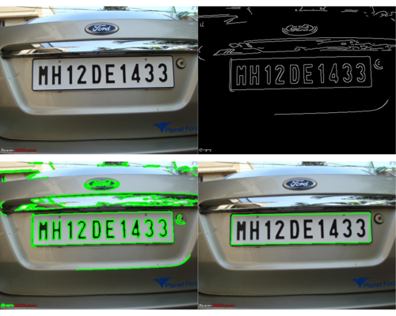

# License Plate Detection

Basic license plate detection using conventional computer vision techniques, including edge detection and contour detection.



## How to Use
To utilize the License Plate Detection tool, follow the steps below:

1. Ensure you have the necessary dependencies installed. If not, you can set up the environment by following the instructions provided in the repository.

2. Run the **`main.py`** script with the following command-line arguments:
```bash
python main.py [-h] [-a AUTO_CANNY] image_path
```
- image_path : Path to the input image.

Options:
- -h, --help : Show the help message and exit.
- -a AUTO_CANNY, --auto_canny AUTO_CANNY : Use auto Canny edge detection (1) or not (0).

### Demo Usage
```bash
python main.py demo/img11.jpg
```
Please ensure that your input image is located within the **`demo`** folder, and the output will be stored in the **`result`** folder.

## Building Your Own Image

1. Clone the repository:
```bash
git clone https://github.com/widyamsib/license-plate-detection.git
```


2. Build the Docker image:
```bash
docker build -t license-plate .
```


3. Run the Docker container to perform license plate detection on an image:
```bash
docker run --rm -v "$PWD"/demo:/src/demo -v "$PWD"/result:/src/result license-plate python main.py demo/img11.jpg
```


## Using My Image

1. Pull the pre-built Docker image from Docker Hub:
```bash
docker pull hiseulgi/license-plate:latest
```


2. Run the provided shell script to perform license plate detection on an image:
```bash
./run_docker.sh image_path
```
If you have trouble with permission denied, please run:
```bash
chmod +x ./run_docker.sh
```


---

**Made with** ❤️ by Muhammad Bagus Adi Prayoga
